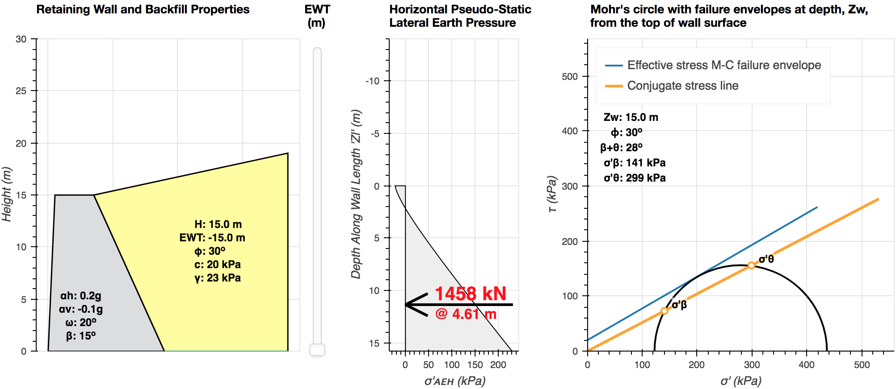

# Seismic Earth Pressure Calculator

### Click [here](http://cue3.engineering.nyu.edu:5010) for the live web application, or read below to run locally.

<br>



If you find our work useful, please cite us:

> Machairas N, Iskander M, Omidvar M (2018) “Interactive Web Application for Computing Seismic Earth Pressure” *Proceedings GEESD V 2018*, ASCE (in review)


<br>

## What is the Seismic Earth Pressure (SEP) Calculator

An interactive web application has been developed to compute seismic earth pressure. The application employs an expanded form of Rankine's classic earth pressure solution. The application computes seismic active earth pressure behind rigid walls supporting c–φ backfill considering both wall inclination and backfill slope. The lateral earth pressure formulation is based on Rankine's conjugate stress concept. The developed expression can be used for the static and pseudo-static seismic analyses of c–φ backfill. The results based on the proposed formulations are found to be identical to those computed with the Mononobe–Okabe method for cohesionless soils, provided the same wall friction angle is employed. For c–φ soils, the formulation yields comparable results to available solutions for cases where a comparison is feasible. The application eliminates the need for design charts, since it can accommodate any set of user-defined kinematically admissible design parameters.

<br>

## Run on your computer

#### Requirements

All programming was done in Python 3.6. You may run the program in any operating system with Python 3.4 or above installed. Required packages for full functionality: `numpy` and `bokeh`. Use `git clone` (recommended) or download ZIP to get this repository on your computer. From within the local repo directory, run the following in your command prompt (terminal) to install the necessary packages with compatible versions.

```
pip install -r requirements.txt
```

There are two ways to perform calculations: A) manually in the command prompt (terminal) and/or B) interactively in the web application.
